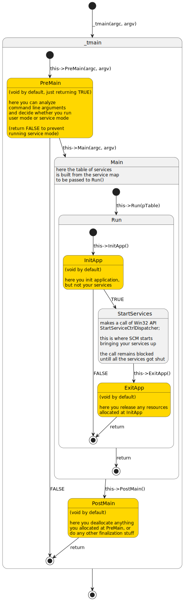

# SFL Architecture Explained

The folder provides examples of using SFL in practice, but some aspects may remain unclear.

Now it’s time to delve a bit into the topic and find out what is under the SFL’s hood.

Two chains of class inheritance are present in SFL. The service class chain is:

```
CServiceProxyT<> -> CYourService -> CServiceBaseT<> -> CServiceRoot
```

The application class chain looks sufficiently more modest:

```
CYourApp -> CServiceAppT<>
```

See details regarding the mentioned classes below in corresponding sections.

The SFL expects the console application type is used for building the service application. This is defined by `SFL_BEGIN_SERVICE_MAP` macro which implements function `_tmain`. The service application class instance is constructed statically before calling the main function – please remember this, being implementing customized application class.

## Function _tmain

After `_tmain` gets called the service class object is constructed. An information about it is passed to application object (to `CServiceAppT<>::Main` member function) which finally calls `StartServiceCtrlDispatcher` internally.

Function `_tmain()` constructs the service map object (in fact it’s an array of `CServiceRoot*` pointers) which entries are initialized by values returned by one of `CServiceProxyT<>::Construct` static member function versions. 

Each map entry initialization call looks like a single `SFL_SERVICE_ENTRY(2)` macro within `SFL_BEGIN_SERVICE_MAP` macro and `SFL_END_SERVICE_MAP` macro braces. The latter macro finishes the map with NULL item.

> [!NOTE]
> Developers, familiar with Unicode programming, already have recognized the well known `_tmain` macro which eventually gets resolved to `main` or `wmain`, depending on the `_UNICODE` project definition.

## Class CServiceRoot

All supplementary service functions are implemented by `CServiceRoot` class. They provide information about service (`GetServiceName`, `GetCurrentStatus`, `GetControlsAccepted`) and set its status appropriately (`SetServiceStatus`, `SetServiceStatusSpecific`). The function `CheckPoint` serves to proper reporting of a pending status.

## Class CServiceBaseT<>

`CServiceBaseT<>` class defines the service part of the framework structure and implements one vital part of service code – `ServiceMain` member function. (See MSDN on [ServiceMain](https://learn.microsoft.com/en-us/windows/win32/services/service-servicemain-function))

The only additional task performed by `CServiceBaseT<>` class is registration of proper `_Handler(Ex)` function according to a service style. 

> [!NOTE]
> The style of the service is defined by `serviceStyle` enumeration declared within `SFL_BEGIN_CONTROL_MAP(_EX)` macro. `SFL_BEGIN_CONTROL_MAP` defines `SFL_SERVICESTYLE_NT4` value and `SFL_BEGIN_CONTROL_MAP_EX` macro defines `SFL_SERVICESTYLE_NT5` appropriately.

Also `CServiceBaseT<>` class contains two void member functions `InitInstance` and `GetServiceContext`. The first one is called inside `ServiceMain`, and its return value will affect if the service instance will report to SCM a status `SERVICE_RUNNING` (in case of successful initialization) or `SERVICE_STOPPED` (in case of initialization failure).

The `GetServiceContext` is called only in case of `SFL_SERVICESTYLE_NT5` style, providing a context to a `HandlerEx` function. You may consider a context like some structure or interface that supplies all data required for proper service functioning. Though the service class itself may be used as service context structure, `GetServiceContext` provides additional level of flexibility available to developer. 

Please, refer to MSDN [HandlerEx](https://learn.microsoft.com/en-us/windows/desktop/api/winsvc/nc-winsvc-lphandler_function_ex) article regarding service context additional details.

> [!NOTE]
> Both these member functions can be overridden in your service class, if this is required.

## Your service class

`CYourService` is your own class that implements the essence of your service – control code handling.

Your service class implements a control map and handler methods for correspondent control codes. In fact a pair of `SFL_BEGIN_CONTROL_MAP(_EX)` and `SFL_END_CONTROL_MAP(_EX)` macros construct a non-static member function `Handler(Ex)` where each `SFL_HANDLE_CONTROL_XXX` entry binds the certain control code to its handler.

Of course, all handlers must be implemented in your class. Depending on service style, they must conform to appropriate handler prototype.

```C++
// SFL_BEGIN_CONTROL_MAP()
typedef DWORD (T::*t_handler)(DWORD&, DWORD&, BOOL&);                       
typedef DWORD (T::*t_handler_range)(DWORD, DWORD&, DWORD&, BOOL&);          

// SFL_BEGIN_CONTROL_MAP_EX()
typedef DWORD (T::*t_handler_ex)(DWORD&, DWORD&, DWORD&, BOOL&, DWORD, LPVOID, LPVOID); 
typedef DWORD (T::*t_handler_range_ex)(DWORD, DWORD&, DWORD&, DWORD&, BOOL&, DWORD, LPVOID, LPVOID);
```

Each prototype corresponds to appropriate `SFL_HANDLE_CONTROL_XXX` macro:

```C++
SFL_HANDLE_CONTROL(code, handler)
SFL_HANDLE_CONTROL_RANGE(codeMin, codeMax, handler)
SFL_HANDLE_CONTROL_EX(code, handler)
SFL_HANDLE_CONTROL_RANGE_EX(codeMin, codeMax, handler)
```

It’s important to remember that non-extended control handler macros/prototypes are usable within `SFL_BEGIN_CONTROL_MAP_EX` control map as well as their extended versions (see [MidSvc](MidSvc/) demo project)

As it was mentioned above, your class may implement `GetServiceContext` and `InitInstance` functions as well. Remember, `InitInstance` call must return true to let your service start running.

> [!TIP]
> Please, do not use any initialization and resource allocation inside class constructor, because you will have an opportunity do this inside `InitInstance` call (see next section). In case your application runs console user mode, your service class even cannot be used.

> [!TIP]
> Some of you might think a complementary `ExitInstance` may exist in the framework to let de-initialize/de-allocate your service class data structures. Sorry guys, you are wrong – any service de-initialization must be done in `SERVICE_CONTROL_STOP` handler. 

## Class CServiceProxyT<>

`CServiceProxyT<>` class is mainly intended for service instantiation. It creates your service class object and integrates your code into application part of the framework. It also interfaces with SCM providing the translation layer for callbacks from SCM to your service code.

`SFL_SERVICE_ENTRY` macro parameter provides a class name for `CServiceProxyT<>` template instantiation along with unique service id. 

> [!NOTE]
> The purpose of the unique id is to distinguish between service clones.

The purpose of proxy class is to provide static member functions `_ServiceMain` and `_Handler(Ex)` which will become known to SCM as `ServiceMain` and `Handler(Ex)` functions of correspondent service. The proxy class object redirects a call to appropriate service class non-static member function.

## Class CServiceAppT<>

`CServiceAppT<>` class defines the application part of the framework structure and implements a vital part of application code – `Main` member function that constructs and initializes `SERVICE_TABLE_ENTRY` array that finally gets passed to Run member function where [StartServiceCtrlDispatcher](https://learn.microsoft.com/en-us/windows/win32/api/winsvc/nf-winsvc-startservicectrldispatchera) Win32 API entry is called. Here is the point where your application turns to a service (at last!) – this call results in invoking SCM functionality, when the static `CServiceProxy<>::_ServiceMain` member function gets called in a new thread specially created by SCM, while the main thread remains suspended until your service stops. As you may suppose, this call eventually ends in calling `ServiceMain` member function of your service class.

## Your application class

Let’s get back to `_tmain` function. At the very beginning we can see that pointer to your application class is got as return value of `SflGetServiceApp` function. The latter constructs your application object statically and returns its constant pointer. 

> [!NOTE]
> This function also may be called anywhere and anytime you need to access the application class object – in your service class, for example.

And when the service map object is initialized, the application object begins to works. First, `PreMain` member function is called. The purpose of it is to process the application initialization (parse and analyze the command line, read environment variables, initialize or allocate some resources, etc.) and finally get a decision if the application must run service mode. If `PreMain` returns TRUE, this means the service must run service mode, therefore `Main` function is called next. But in case, the application runs console user mode, `PreMain` must not return until application shutdown, when it finally returns FALSE. `PostMain` function is called before application end in any mode, letting to release all resources allocated in `PreMain`.

Your application class may implement `PreMain` and `PostMain` in case it requires for some application initialization/de-initialization routines. Otherwise the base class function (with void function body) will be called.

> [!NOTE]
> In case your application does not require any specific functionality, the `CSimpleServiceApp` class, defined by SFL, is at your disposal. The class merely instantiates `CServiceAppT<>` template class – and does nothing more than that.

Two ways of service entry declaration (`SFL_SERVICE_ENTRY(2)` macros mentioned above in Function `_tmain` section) are provided by SFL:

```C++
SFL_SERVICE_ENTRY( TService, idRes )
SFL_SERVICE_ENTRY2( TService, id, name )
```

In the first case your service class name and resource id are used to construct the service object. Resource id specifies the string table entry to be used as service name and additionally provides unique service id required for correct service class instantiation.

In the second case unique service id and service name string are provided explicitly and independently to each other. 

# Application life cycle



> [!TIP]
> Golden boxes denote overridable methods.

# Service life cycle

> [!NOTE]
> A bit simplified state diagram not showing pending states is below. Pleas refer to MSDN for full details about possible service states and transitions among those.


> [!TIP]
> Golden boxes denote overridable methods and control handlers.
